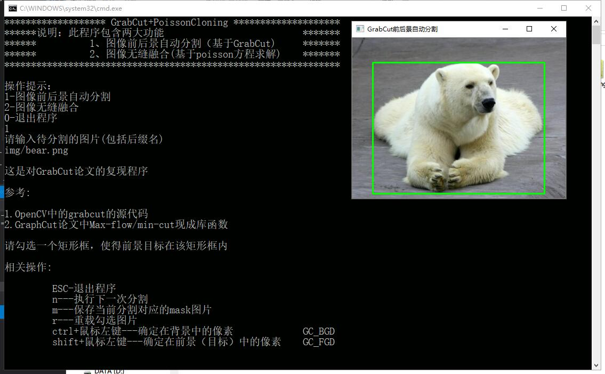
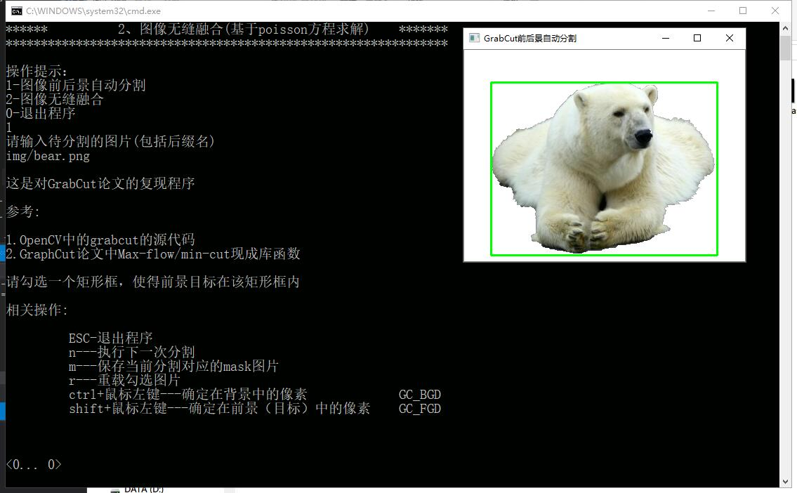
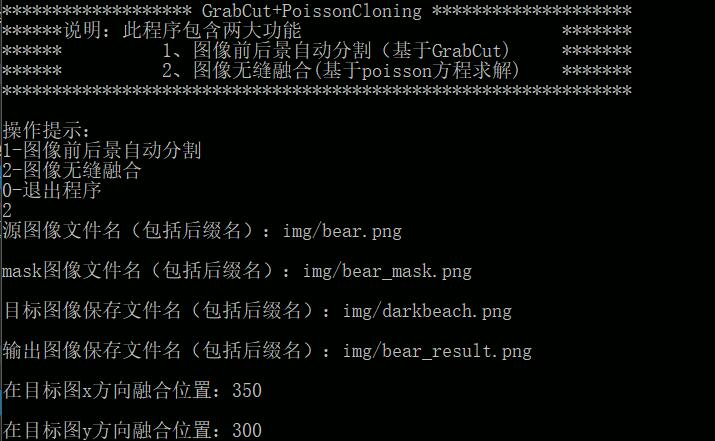
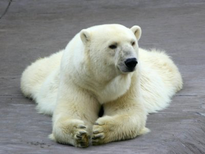
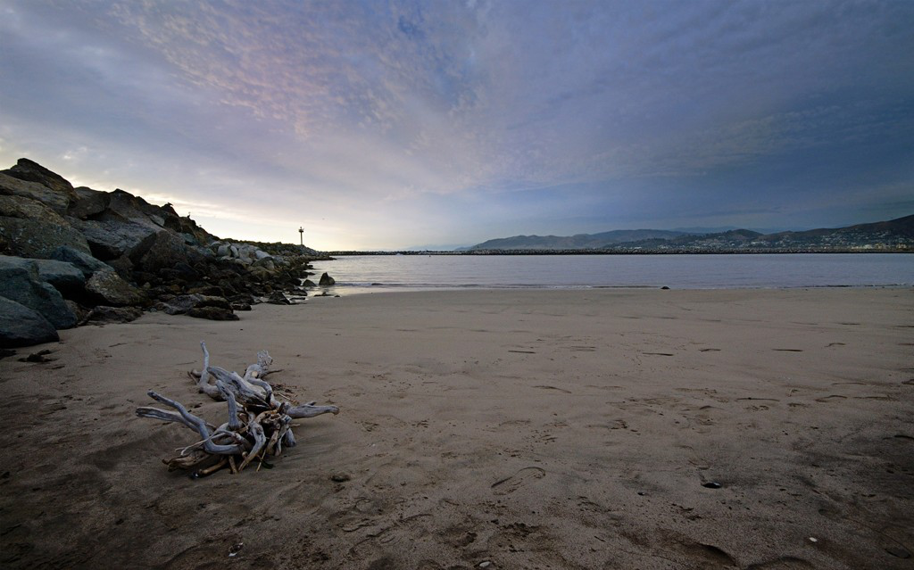
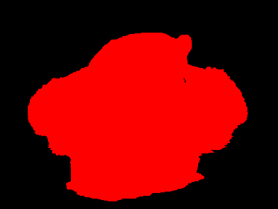
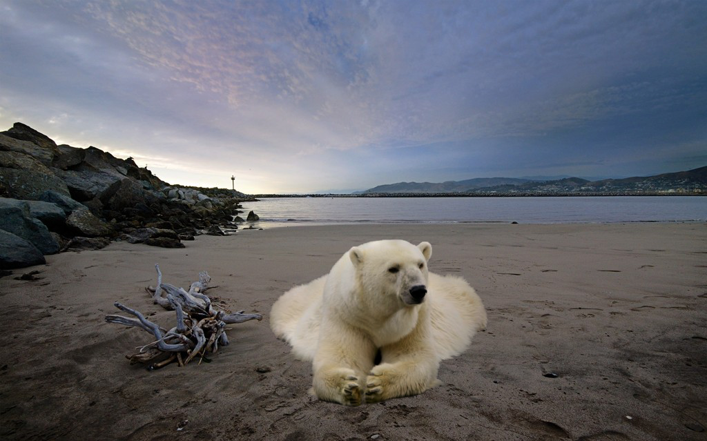

# Overview
This is a image tool which integrates the image foreground automatic segmentation with seamless image blending as a total. Specifically, this is a tool integrates two algorithms, they are `GrabCut` and `Possion Image Blending` respectively. 

The former, `GrabCut`, is a popular interactive foreground extraction method based on few user input. What you need to do is just to drag a rectangle to cover the foreground object. The latter, `Possion Image Blending`, is also an appealing work based on the pixels' intensities aorund the boundry and the pixels' intensity gradients which fall in the region the bourny circles.

Thanks for Prof. Shaoping Lu who gives me this idea to integrate these two work together. I implemented this repo just for interests and study. 'Cause I did't used any graphic accelerations and I am not very good at c++/c language, the running time of this tool cannot reach to the real-time level. But our basic requirements can be met.

# Environment
- C++
- Visual Studio 2015 with x64 runtime

# Usage
I have written some code for interactive prompts. Have a try now!

#### Run the `main.cpp`, after that:

1. Foreground Extraction

 1.1 Choose an image (`img/bear.png` here)
 
 1.2. Drag a rectangle to cover the foreground obejct

During this step, you can press `r` to redrag the rectangle. You can also press `shift` or `ctrl` and drag your mouse leftkey simultaneously to mark some ground truth foreground or background pixels. For detail usage, you can check out the code.

 1.3. Press `n` to start segmentation.

 
 1.4  Press `m` to save the mask image. The file name of the mask image is set to be `XXX_mask.png `， where XXX is your input image file name.

 1.5 Press `Esc` to back to main menu.

2. Possion Image Blending

As the above image indicating, you have to specifiy the `source image location`,`mask image location`,`target image location`,`where to save output image`,`x-coordinate`,`y-coordinate` respectively. The last two coordinates tell the program where to put the source image (starts at (0,0) of taeget image, i.e. left-upper corner).

#### Check it out:
Input:

Output:

# References
[1] Carsten Rother, Vladimir Kolmogorov, Andrew Blake:  “GrabCut” — Interactive Foreground Extraction using Iterated Graph Cuts. 2004

[2] Patrick Perez, Michel Gangnet, Andrew Blake: Poisson Image Editing.

[3] OpenCV GrabCut implementation.